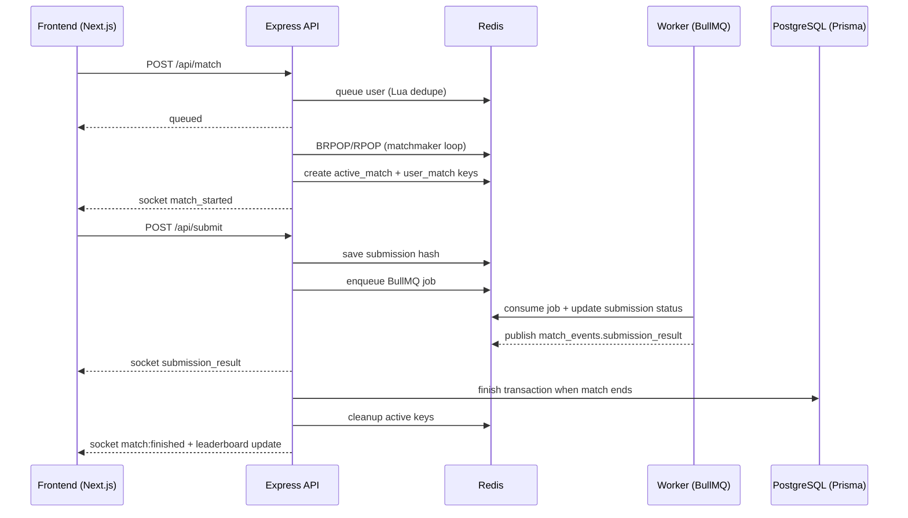

# 01 - Architecture and End-to-End Flow

## 1) What the project is

`AlgoArena Live` is a real-time coding battle platform for DSA practice with:

- Quick 1v1 matchmaking
- Friend duels
- Solo practice mode
- Live submissions and progress updates
- Elo-style rating + leaderboard

## 2) Monorepo architecture

### Workspace layout

- `apps/web`: Next.js 16 App Router frontend
- `apps/server`: Express API + Better Auth + Socket.io realtime layer
- `apps/worker`: BullMQ worker executing user code in Docker
- `packages/db`: Prisma schema and generated client
- `packages/queue`: Redis/BullMQ connection + queue/event exports
- `packages/types`: Shared types (e.g. testcase shape)
- `docker-compose.yml`: local PostgreSQL and Redis

### Why split web/server/worker

- The frontend serves UX and stateful UI.
- The API/realtime service manages auth, sessions, REST, socket rooms, and match orchestration.
- The worker isolates CPU-heavy and potentially unsafe code execution from request-response traffic.

This split avoids blocking API threads during code execution.

## 3) Runtime components

### Frontend (`apps/web`)

- Route guarding via `proxy.ts` (cookie-based redirect logic).
- Session integration via `auth-client`.
- Socket client singleton in `lib/socket.ts`.
- Runtime state with Zustand stores:
  - `stores/matchStore.ts`
  - `stores/submissionStore.ts`
  - `stores/matchProgressStore.ts`
  - `stores/matchResultStore.ts`
  - `stores/friendsListStore.ts`

### Backend (`apps/server`)

- HTTP routes mounted in `src/app.ts`:
  - `/api/auth/*` (Better Auth handler)
  - `/api/social`, `/api/submit`, `/api/setquestions`, `/api/match`, `/api/chat`, `/api/leaderboard`
- Authentication middleware: `src/middleware/middleware.ts` (`isActiveSession`)
- Socket events:
  - Main namespace in `src/sockets/index.ts`
  - Friend chat namespace (`/friends`) in `src/sockets/chatsocket.ts`
- Match lifecycle:
  - Queue and retrieval: `src/services/match.service.ts`
  - Match creation: `src/helpers/matchMaker.helper.ts`
  - Match finishing and Elo updates: `src/helpers/finishMatch.helper.ts`
  - Timeout scheduling and crash recovery: `src/utils/ExpirationManager.ts`

### Worker (`apps/worker`)

- `src/workers/codeWorker.ts` consumes BullMQ jobs, executes code with Docker, parses errors, and publishes results over Redis pub/sub.

### Data and infra

- PostgreSQL (persistent): users, matches, submissions, leaderboard, social graph, messages.
- Redis (ephemeral + fast): waiting queue, active matches, submission hashes, expiration zset, queue backend.

## 4) End-to-end flow: user journey

## 4.1 Boot and auth flow

1. User opens app.
2. `apps/web/proxy.ts` checks session cookie.
3. If authenticated, user can access protected routes (`/dashboard`, `/code`, `/friends`).
4. API auth checks use `isActiveSession` middleware in backend routes.

## 4.2 Quick match flow (random 1v1)

1. Frontend starts queue request via `useMatchMaker` (`apps/web/hooks/useMatchMaker.ts`).
2. API receives `POST /api/match` (`matchController` in `src/controllers/match.controller.ts`).
3. `queueUserForMatch` (`src/services/match.service.ts`) pushes user to Redis waiting list using Lua dedupe logic.
4. Matchmaker loop (`src/sockets/matchMaker.ts`) performs:
   - `BRPOP waiting_users`
   - `RPOP waiting_users` for second player
   - `createMatch` helper call
5. `createMatch` helper (`src/helpers/matchMaker.helper.ts`) reserves user keys and writes active match hash.
6. Socket events `match_started` and `match:ready` are emitted; frontend routes to `/code/[slug]`.

## 4.3 In-match submit flow

1. User submits from `apps/web/app/code/[slug]/page.tsx`.
2. API endpoint `/api/submit` validates:
   - session/user
   - active running match
   - user belongs to match
   - question exists in match
3. Submission is stored in Redis hash for that match/user.
4. Job enqueued to BullMQ queue (`code-execution`) via `@repo/queue`.
5. Worker executes code in Docker (`apps/worker/src/workers/codeWorker.ts`).
6. Worker writes result status and publishes Redis pub/sub `match_events`.
7. Server socket subscriber forwards `submission_result` to player.
8. If passed, opponent gets `opponent_submission_passed`.
9. If user solved all questions, `finishMatchById` auto-triggers.

## 4.4 Match finish flow

Triggered by:

- User manual finish (forfeit style) `POST /api/match/finish/:matchId`
- Auto-finish on full solve
- Timeout via `ExpirationManager`

`finishMatchById` (`src/helpers/finishMatch.helper.ts`) performs:

1. Mark status as `FINISHING` in Redis active match hash.
2. Load submissions from both users in Redis.
3. Compute solved question sets, scores, tie-break by earlier submission timestamps.
4. Transaction in Prisma:
   - update both user ratings (Elo formula)
   - create `Match` and `MatchParticipant`
   - create `Submission` rows
   - update `LeaderboardEntry` stats (wins/losses/streak)
5. Cleanup Redis keys and expiration entries.
6. Emit `match_finished` pub/sub event and `leaderboard_update` socket broadcast.

## 4.5 Practice mode flow

1. Frontend uses `/code` page (`apps/web/app/code/page.tsx`).
2. Questions loaded via `/api/setquestions`.
3. Submission uses `/api/submit/solo` (`submitPracticeController`).
4. Worker executes code with `matchId: "practice"`.
5. Results still streamed via socket, but no full match persistence lifecycle.

## 5) Sequence diagram (text)

## 6) Key strengths of architecture

- Real-time UX through socket events and room semantics.
- Ephemeral-vs-persistent data split (Redis vs Postgres).
- Worker isolation for potentially unsafe execution.
- Match state recoverability with expiration zset + `recover()`.

## 7) Current weak points visible in code

- `apps/server/src/config/config.ts` includes hardcoded Google OAuth fallback secrets (should be removed).
- Dual invite systems (`sockets/index.ts` and `sockets/chatsocket.ts`) increase complexity and inconsistency risk.
- `packages/queue/src/index.ts` uses `drainDelay: 0` despite known issue that BullMQ expects `> 0`.
- Some socket cleanup listeners are commented out in frontend `useSocket.ts`.

These are useful to discuss honestly in interviews (with improvement plan).

